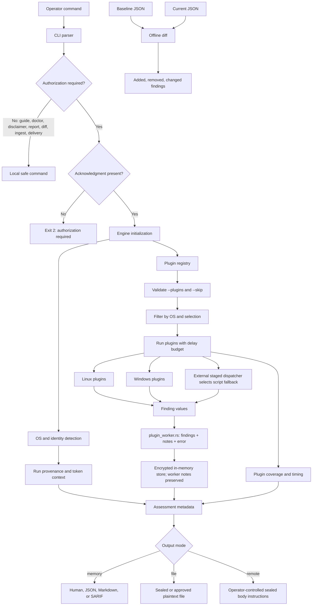

# Architecture Diagram

The diagram shows the normal data flow from an operator command to a report.
Dashed paths are optional or platform-specific. The default path does not
write to disk and does not execute an exploit.

## Component map

| Component | Responsibility |
| --- | --- |
| CLI parser | Flags, subcommands, defaults, and authorization gate inputs |
| Engine | OS selection, plugin validation, scheduling, checkpoint/triage orchestration |
| Plugin worker | Isolated execution, cancellation/timeout, and finding/note/error return |
| Reporting | Assessment, attack-path, and final report assembly |
| Identity/OS modules | Minimal local platform and execution-context evidence |
| Plugins | Independent Linux or Windows enumeration checks |
| Store | In-memory findings and authenticated encrypted export |
| Output | Human, JSON, Markdown, SARIF, file, and operator-controlled remote modes |
| Diff | Offline comparison of two plaintext JSON reports |
| CI UX gate | Release-binary contract checks across the user-visible command surface |

## Safety boundaries

- Authorization is required before host enumeration.
- Default execution is enumeration-only.
- High-impact families require `--allow-techniques` (scaffolded in this revision;
  AMSI/ETW/AV-EDR families have no execution modules).
- Reversible write probes require an exact finding approval or explicit
  standalone `--auto-exploit`.
- Reports and keys are kept separate when evidence is persisted.
