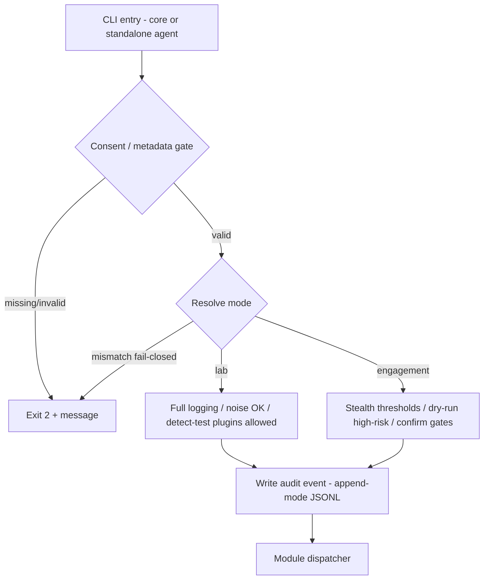
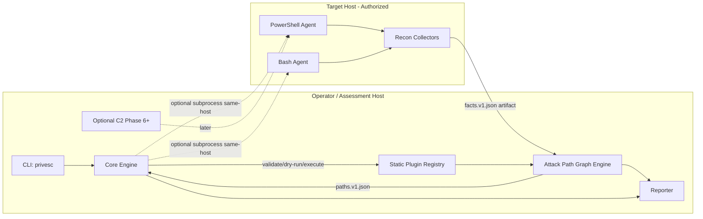
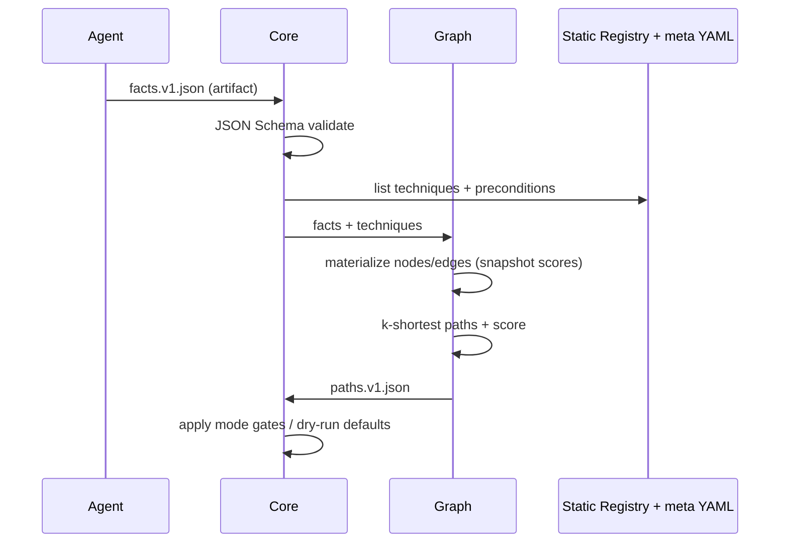
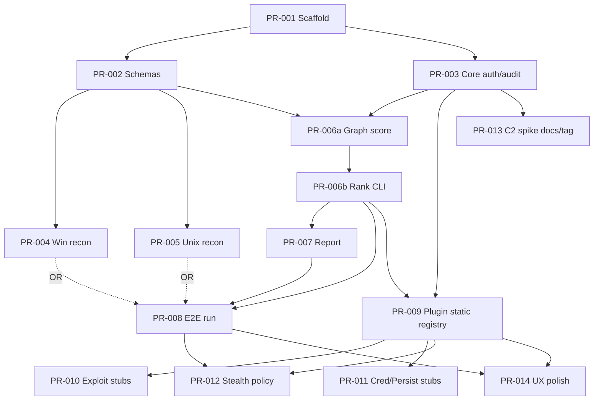

# Next-Gen Stealthy Privilege Escalation Tool – High-Level Design

| Field | Value |
|-------|-------|
| **Document Title** | Next-Gen Stealthy Privilege Escalation Tool – High-Level Design Blueprint |
| **Author** | TBD |
| **Date** | 2026-08-18 |
| **Status** | Draft |
| **Audience** | Senior engineers, red-team tooling leads, security researchers |
| **Repo** | `C:\Users\tsaxon\Documents\Github\StealthyPrivesc` (greenfield) |

---

## Overview

This document specifies a modular, attack-path-aware privilege escalation toolkit for **authorized** red teaming, penetration testing, and security research. The product combines cross-platform recon agents (PowerShell on Windows; Bash on Linux, with macOS best-effort), a shared fact and report schema, an attack-path graph engine that ranks escalation routes by stealth and reliability, and a plugin architecture for exploitation, credential access, persistence, and evasion—without embedding step-by-step exploit recipes or malware-grade payloads in early delivery.

The differentiator is the **Attack Path Graph Engine**: recon facts become typed nodes and scored edges; the engine recommends the most reliable/stealthy path under operator-configured thresholds. **v1 default recon/report topology** is operator-host core + on-target agents exchanging artifacts (`facts.v1.json` → `paths.v1.json` → `report.v1.json`). Privilege-affecting **Execute** uses an on-target **plan handoff** (`plan.v1.json` → `privesc plan apply` / agent `-ApplyPlan`); the operator host never elevates a remote OS directly (KD-18). Optional C2/orchestration is deferred to later phases. Lab/Detection-research mode and Engagement mode enforce different defaults for noise, confirmation gates, and dry-run behavior. A mandatory **consent/metadata gate** and operator audit log are required before any module runs (soft control—see KD-7).

---

## Background & Motivation

### Current state

The repository is greenfield: Git repo on `main` with a single commit (`e29a93b Initial commit`). Tracked content historically includes only `.gitattributes` (working tree may show it deleted). There is no source layout, CI, project instruction files (`AGENTS.md` / `Claude.md`), or packaging yet (core language decided: Go 1.22+). **PR-001 should not assume a completely empty tree**—preserve or replace `.gitattributes` deliberately (e.g., line-ending policy for PS1/SH).

### Pain points with existing tooling

| Tool class | Examples (prior art) | Typical gaps |
|------------|----------------------|--------------|
| Enum scripts | WinPEAS, LinPEAS, Seatbelt | Excellent recon; weak path ranking and cross-OS shared model |
| Offensive frameworks | Empire, Covenant, Metasploit, PowerSploit | Broad post-ex; heavy footprints; not path-graph-first |
| Ad-hoc scripts | One-off PS1/Bash | Not modular; inconsistent risk scoring; poor auditability |

Operators need a single workflow: collect facts quietly → build a scored graph → validate preconditions → execute (or dry-run) the best path → produce an engagement-grade report. Today that workflow is manual glue across tools with inconsistent schemas and no first-class authorization/audit story.

### Why now

- EDRs make naive “run everything loud” approaches costly in engagements.
- Path selection (reliability × stealth) is rarely automated with a portable graph schema.
- Cross-platform engagements need compatible facts/reports without forcing identical runtimes.

---

## Goals & Non-Goals

### Goals

1. **Authorized use only**: Mandatory **consent/metadata gate** (engagement metadata + legal acknowledgement + expiry), plus operator audit logging suitable for scoped assessments. This is a procedural control, not cryptographic enforcement of ROE (see KD-7).
2. **Stealth-aware by design**: Stealth/noise scoring on techniques; prefer LOLBins and memory-oriented patterns where plugins exist; delays and output caps on recon.
3. **Modular plugins**: Clear interfaces for recon, graph, exploitation, credential access, persistence, evasion, and reporting—contracts first, category plugins later.
4. **Attack-path awareness**: Concrete graph schema, scoring formula, and ranking algorithm implementable in Phase 2.
5. **Cross-platform shared model**: Compatible fact and report schemas from Windows and Linux agents; macOS emits the same envelope with a reduced collector set in v1.
6. **Simple UX**: Single-command auto mode, interactive module selection, YAML config, color-coded reports.
7. **Phased, reviewable delivery**: Scaffolding → recon → graph → reporting before any post-exploitation plugins; C2 optional and late.
8. **Mode differentiation**: Lab/Detection-research vs Engagement (authorized) with different defaults.

### Non-Goals

1. **Not a general malware framework** or unattended worm/lateral blast tool for v1.
2. **No exploit recipe cookbook** in this design or early PRs: no working AMSI/ETW bypass code, LSASS dump recipes, or ready-to-use persistence payloads documented as copy-paste steps.
3. **No mandatory C2** for Phases 1–5; local single-host agent is sufficient.
4. **No guarantee of EDR evasion**; stealth is a scored objective and engineering constraint, not a promise.
5. **Domain-wide / forest-wide targeting and lateral movement execution** are out of scope for v1. Schema may reserve enum values; v1 goal wire IDs are `goal.local_admin|goal.root|goal.system` only (KD-17).
6. **Illegal or unauthorized use** is explicitly unsupported. Building or using this tool against systems without **explicit written permission** is illegal and unethical.
7. **macOS TCC/SIP bypass and full macOS privilege-model parity** are non-goals for v1 (identity/host facts only on macOS).
8. **Subprocess / dynamic plugin loading** is a non-goal for v1 (static registry only).

---

## Key Decisions

| # | Decision | Rationale |
|---|----------|-----------|
| KD-1 | **Agent-first, local single-host**; optional C2 only in Phase 6+ | Unblocks recon/graph/reporting without network architecture; matches “PR Plan starts safe.” |
| KD-2 | **Compiled core engine is Go 1.22+** + thin script agents (PowerShell / Bash) | User-confirmed: static binaries, easy cross-compile, strong concurrency for graph/report; PS/Bash remain OS-native collectors. Closes Open Question 1. |
| KD-3 | **Shared JSON fact schema + JSON report schema** as the cross-platform contract | Agents may differ; graph engine and reporter must not. |
| KD-4 | **Attack Path Graph is the product differentiator**; implement schema/scoring before exploitation plugins | Forces recon quality and safe dry-run validation early. |
| KD-5 | **Plugin interfaces with risk scores, preconditions, validate/dry-run**—not inline exploit recipes | Legal/ethical posture, reviewability, and blue-team lab reuse. |
| KD-6 | **Two runtime modes: `lab` and `engagement`** | Lab: noisy-OK, full logs, optional detectable actions. Engagement: stealth thresholds, dry-run default for high-risk, confirmation gates. |
| KD-7 | **Consent/metadata gate + audit JSONL (append-mode)** required before module execution; **not** a cryptographic ROE proof | Suitable for authorized engagements and AAR; any operator can forge an auth file—treat as mandatory UX/process control. Optional signed auth is a later enhancement. |
| KD-8 | **Feature flags for post-ex plugin categories** | Prevents accidental merge of high-risk plugins before interfaces and review bars exist. |
| KD-9 | **Python is not allowed on target agents in v1** (Bash-only on Unix targets). Optional Python remains operator-workstation research tooling only | Closes prior Open Question 2; keeps target footprint minimal and predictable. |
| KD-10 | **MITRE ATT&CK technique IDs as optional metadata on technique nodes** | Aids reporting and lab mapping without coupling ranking solely to ATT&CK. |
| KD-11 | **Default engagement posture: dry-run for `risk >= high`; default engagement `stealth_level: high`** | Destructive/high-detection actions need explicit operator confirmation; high stealth is the engagement default (closes Open Question 3). |
| KD-12 | **Repo layout: `core/`, `agents/`, `schemas/`, `plugins/`, `configs/`, `docs/`, `tests/`, `scripts/`** | Clear ownership boundaries for greenfield growth. |
| KD-13 | **v1 recon/report topology: operator-host core + on-target agents via artifact exchange** (`PRIVESC_OUT_DIR`). Standalone agents enforce the agent-tier consent gate. Core need not be on target for MVP recon→graph→report | Clear trust boundary for the non-elevating MVP loop. |
| KD-14 | **v1 plugin host: compile-time/static registry in Go core + `plugin.meta.v1` YAML beside stubs**; subprocess plugins deferred | Avoids Go plugin/Windows pain; single source of truth for preconditions/scores after PR-009 owns metadata. |
| KD-15 | **Facts may contain sensitive values**; default output dir permissions `0700`/`User-only` ACL; `facts.redact_at_rest` optional; reports redact by default | Prevents naive secret leakage via world-readable working dirs before report rendering. |
| KD-16 | **v1 Unix agent is Linux-first**; macOS is best-effort (`os_family=macos`) with identity/host collectors only | Avoids empty/misleading graphs from Linux-centric checks on Darwin. |
| KD-17 | **Domain/AD + lateral are out of v1**; enum values remain `reserved`; ranking goals limited to wire IDs `goal.local_admin\|goal.root\|goal.system` | User-confirmed: local-host goals only; prevents graph scope creep while keeping schema forward-compatible. Closes Open Question 4. |
| KD-18 | **Plan/Execute handoff:** operator-host core ranks and emits `plan.v1.json` (Validate/DryRun only—no remote elevation). Privilege-affecting **Execute/Apply runs on the target** via on-box core (`privesc plan apply`) or agent `-ApplyPlan` that invokes local core. **On-target context** = live `host_id` probe equals `plan.host_id` and facts-derived `host_id` (else exit `6`). Pure script execute bridges and C2 apply = Phase 6+ | Reconciles KD-13 artifact MVP with KD-14 Go registry Execute; host binding prevents applying target plans against the operator workstation. |

---

## Proposed Design

### Authorization & modes



**Consent/metadata gate (required; soft control):**

This gate **does not cryptographically prove** that a Rules of Engagement (ROE) document authorizes the operator. It is a **mandatory consent and engagement-metadata check** plus audit trail. Stronger bindings (signed auth files, org public keys) are optional Phase 7+ enhancements (`auth.v1` reserved field `signature`).

Operator must supply engagement metadata via flags and/or config:

- `--auth-file path/to/authorization.json` **or** env `PRIVESC_AUTH_FILE`
- Required fields and validation:

| Field | Rule |
|-------|------|
| `schema_version` | Must be `1.0.0` for v1 |
| `engagement_id` | Non-empty string; `[A-Za-z0-9._-]{3,128}` |
| `client` | Non-empty display string |
| `scope_text` | Non-empty; human-readable scope summary (min 16 chars) |
| `scope_hash` | `sha256` hex (64 chars `[0-9a-fA-F]`) of **UTF-8 NFC-normalized `scope_text`** with CR stripped and newlines as LF only (no BOM); compared case-insensitive |
| `operator_id` | Non-empty string |
| `authorized_until` | RFC 3339 UTC; must be **strictly after** gate evaluation time |
| `mode` | `lab` \| `engagement` |
| `acknowledged_legal` | Must be JSON `true` |
| `signature` | Optional; omit in v1. If present and `auth.require_signature=true`, verify later |

**`scope_hash` canonical bytes (authoritative for Go core):**

1. Take `scope_text` as a Unicode string from JSON.
2. Normalize to **NFC** (Unicode Normalization Form C).
3. Encode as UTF-8 with **no BOM**.
4. Replace CRLF → LF and strip any remaining CR (`\r`), leaving LF-only newlines.
5. `scope_hash = hex(SHA-256(bytes))` lowercase preferred; compare case-insensitive.

**Consent verification tiers (parity without forcing NFC on Bash):**

| Tier | Who | Checks |
|------|-----|--------|
| **Full** | Go core (`privesc auth check`, `run`, `plan apply`) | JSON Schema + all field rules + **recompute** NFC `scope_hash` and compare |
| **Agent** | PowerShell / Bash standalone agents | Required fields present/typed; `acknowledged_legal==true`; `authorized_until` not expired; mode match vs CLI/config; `scope_hash` **format** = 64 hex chars; **do not require** NFC recompute on Bash. PowerShell **should** recompute when `[string]::Normalize` is available; if recompute fails open, fall back to format-only and audit `scope_hash_unchecked=true` |
| **Optional strict agent** | When `sha256sum`/`shasum` **and** NFC tooling (`uconv -x any-nfc` or equivalent) exist | Agent may recompute; still not required for v1 portability |

Shared golden `auth` fixtures under `tests/schema/auth/` are hashed by Go tests; agent fixture scripts assert field/format gates against the same files. Three implementations must not silently diverge on Full-tier rules—agents document Agent-tier limits in `--help`.

- **Full tier** verifies: file readable + JSON Schema valid + rules above + mode consistency (see precedence) + NFC hash recompute.
- Failure: no recon, no plugins, no report beyond an auth-failure audit line **if** `PRIVESC_OUT_DIR` is already writable; else stderr only. Exit code `2`.

**Mode / flag precedence (fail closed):**

1. If CLI `--mode` is set **and** auth file `mode` differs → **deny** (do not silently prefer CLI).
2. Else auth file `mode` is authoritative.
3. Config file `mode` must equal auth mode if present; else **deny**.
4. `--force` never bypasses auth expiry or `acknowledged_legal`.
5. Lab mode **still requires** valid auth (including expiry)—lab is not an auth bypass.

**Action decision table** (`action × mode × risk → outcome`).  
**Topology column:** `any` = operator-host or on-box; `on-target` = **live `host_id` bind succeeds** (`live_host_id == plan.host_id == facts_host_id`) on the host running apply (on-box core or agent → local core). Failure of that bind is the operational definition of “operator-host / wrong-host” deny (exit `6`), including applying target artifacts on a workstation (KD-18).

| Action | Topology | Mode | Plugin `risk` | Outcome |
|--------|----------|------|---------------|---------|
| recon collect | on-target agent | lab / engagement | n/a | **allow** (stealth caps from mode defaults) |
| graph build/rank | any | lab / engagement | n/a | **allow** |
| report render | any | lab / engagement | n/a | **allow** |
| plan export (`plan.v1`) | any | lab / engagement | n/a | **allow** after Validate/DryRun on facts |
| plugin validate / dry-run | any | lab / engagement | any | **allow** if feature flag on (or always for validate metadata); side-effect free |
| plugin execute / `plan apply` | **operator-host only** | any | any | **deny** (no remote elevation channel in v1) |
| plugin execute / `plan apply` | **on-target** | lab | low \| medium | **allow**; if `requires_confirmation` → **confirm** unless `--force` |
| plugin execute / `plan apply` | **on-target** | lab | high \| critical | **confirm** (required); `--no-interactive` without `--force` → **deny** |
| plugin execute / `plan apply` | **on-target** | engagement | low | **allow**; confirm if `requires_confirmation` |
| plugin execute / `plan apply` | **on-target** | engagement | medium | **confirm** if `requires_confirmation`; else allow |
| plugin execute / `plan apply` | **on-target** | engagement | high \| critical | **dry-run-only** by default; execute only with `--execute-high-risk` **and** confirm (or `--force` + `--execute-high-risk`) |
| detect-test plugin execute | on-target | engagement | any | **deny** |
| detect-test plugin execute | on-target | lab | any | **allow** if feature flag on; else deny |

**`--force` / `--no-interactive` interaction:**

- `--no-interactive`: any outcome that would be **confirm** becomes **deny** unless `--force` is also set (except engagement high/critical execute, which still needs `--execute-high-risk`).
- `--force`: auto-answers confirmations **yes** where confirm is allowed; does **not** override auth gate, detect-test deny in engagement, or missing `--execute-high-risk` for engagement high/critical.

**Audit log:**

- **Append-mode** JSON Lines at a configured path under **operator-controlled** `PRIVESC_OUT_DIR` by default. Integrity is **not** guaranteed on shared/target disks (no WORM/OS append-only enforcement in v1). Prefer operator workstation paths; if agents must write locally, document the tampering residual risk.
- Each event: `ts`, `engagement_id`, `operator_id`, `host_id`, `mode`, `action`, `module`, `result`, `dry_run`, `risk`, `sha256(config_slice)`.
- Both modes: audit is mandatory when an output dir is configured.

### Execution topology (v1)

**Default recon→graph→report (KD-13):** operator-host core + on-target agents via **artifact exchange**. Core is not required on the target for that MVP loop.

**Plan→Execute handoff (KD-18):** privilege-affecting work never runs “from” the operator host against a remote OS. Operator-host core may only **Validate/DryRun** against `facts.v1.json` and **export** `plan.v1.json`. Apply/Execute runs **on the target**.

```mermaid
sequenceDiagram
  participant Op as Operator Host
  participant CoreOp as privesc core (operator)
  participant Tgt as Target Host
  participant Agent as Agent PS/SH
  participant CoreT as privesc core (on-box)
  Op->>Op: Write auth.json + config
  Op->>Tgt: Copy agent scripts + auth.json (authorized channel)
  Tgt->>Agent: privesc-tool.* -Auto -AuthFile auth.json -OutDir ./out
  Agent->>Agent: Consent gate (agent tier)
  Agent->>Tgt: Write out/facts.v1.json (mode 0600 / ACL user-only)
  Tgt->>Op: Copy out/facts.v1.json back
  Op->>CoreOp: graph rank + report render
  Op->>CoreOp: plugin dry-run / plan export - out/plan.v1.json
  Op->>Tgt: Copy plan.v1.json + auth + privesc binary (if Execute desired)
  Tgt->>CoreT: privesc plan apply --plan plan.v1.json
  Note over Agent,CoreT: Agent -ApplyPlan delegates to local privesc; pure-script Execute bridges Phase 6+
```

| Topology | v1 support | Auth enforcement |
|----------|------------|------------------|
| Operator core + agent artifact exchange (recon/report) | **Default MVP** | Agent-tier gate on agent; Full tier on core |
| Operator core Validate/DryRun + `plan.v1` export | **Supported** | Full tier; **no** Execute |
| On-target `privesc plan apply` (on-box core) | **Required path for Execute** | Full tier on-box |
| Agent `-ApplyPlan` | **Supported** if local `privesc` present; else exit `10` not-implemented | Agent-tier then hands off to Full tier core |
| Same-host: core invokes agent as subprocess | Convenience when already on target | Core Full + agent re-check |
| Standalone agent without core | Recon-only | Agent-tier; refuses collectors without auth (exit `2`) |
| Pure script Execute adapters / C2 apply | Phase 6+ | Auth/`authorized_until` bound into session |

#### `plan.v1` handoff contract

```json
{
  "schema_version": "1.0.0",
  "engagement_id": "string",
  "host_id": "hex-sha256",
  "mode": "lab|engagement",
  "created_at": "RFC3339",
  "created_by_operator_id": "string",
  "facts_sha256": "hex",
  "paths_ref": "paths.v1.json",
  "selected_path_id": "path-1",
  "steps": [
    {
      "plugin_id": "windows.service.stub",
      "action": "validate|dry_run|execute",
      "risk": "medium",
      "requires_confirmation": true,
      "plan_steps": [
        { "verb": "check", "summary": "Validate service-related preconditions from facts" }
      ]
    }
  ],
  "constraints": {
    "execute_high_risk": false,
    "feature_flags_required": ["plugins.exploitation.windows.example"]
  }
}
```

**`facts_sha256` byte recipe (v1):**

```text
facts_sha256 = lowercase hex(SHA-256(raw file bytes of facts.v1.json as written on disk))
```

- Hash the **exact octet stream** of the facts file the exporter read (or just wrote)—not pretty-printed re-serialization, not BOM-stripped rewrites, not canonical JSON transforms.
- `privesc plan export` computes the digest from the same path passed as `--facts` and embeds it in `plan.v1.json`.
- Operators must copy **that same byte-identical** `facts.v1.json` on-target with the plan. Any edit/re-save that changes bytes fails the check.
- Apply: read on-disk facts file → SHA-256 raw bytes → compare case-insensitive to `plan.facts_sha256`.
- Lab-only escape: `--ignore-facts-hash` (default off). **Engagement mode: flag forbidden** (deny with exit `5` / validation error if passed).

**On-target context detection (required before Execute; exit `6`):**

“On-target” is **not** inferred from “no C2” or from `facts_sha256` alone (copied target facts on an operator workstation would still hash-match). Before any privilege-affecting `Execute`:

1. Load `plan.v1.json`; require `plan.host_id` present (64-hex).
2. Load facts file; compute `facts_host_id` using the **same `host_id` canonical recipe** from `facts.host` + `facts.identity` fields in that file.
3. Run a **live local identity probe** on the machine where `plan apply` executes (minimal collectors: os_family, hostname, uid_or_sid only—same fields as the recipe). Compute `live_host_id` with the identical canonical recipe.
4. **Allow Execute only if** `live_host_id == plan.host_id == facts_host_id` (case-insensitive hex compare).
5. On mismatch or probe failure → **deny Execute**, audit `topology_deny`, message explaining host binding failure, **exit `6`**. Validate/DryRun-only subcommands may still run against artifacts without live bind when `--dry-run` is explicit; default `plan apply` that would Execute must bind.

| Flag | Lab | Engagement |
|------|-----|------------|
| `--allow-host-mismatch` | Allowed (default **off**); permits Execute despite host_id mismatch for detection-research harnesses; audit loudly | **Forbidden** — treat as engagement policy violation (exit `5`/`6`) |
| `--ignore-facts-hash` | Allowed (default off) | **Forbidden** |

Operator-host deny in the action table **means** this live `host_id` bind failed (typical when applying a target plan on the workstation): Execute would mutate the **local** OS while facts describe another host. It is not merely “absence of a remoting channel.”

**Apply order:** Full-tier auth → load plan + facts → `facts_sha256` check → live `host_id` bind → re-Validate → mode/risk gates → Execute (if requested).
**Artifact directory contract:**

```text
$PRIVESC_OUT_DIR/                  # default: ./privesc-out ; create with 0700 / User-only ACL
  auth.json                        # optional copy; prefer not left on target post-engagement
  facts.v1.json
  graph.v1.json                    # optional debug
  paths.v1.json
  plan.v1.json                     # DryRun export; required for on-target apply
  report.v1.json
  report.md
  audit.jsonl
```

**IPC / composition rules:**

- Agents speak **files + exit codes**, not a custom RPC in v1.
- Optional same-host path: `privesc recon collect` spawns `pwsh`/`powershell` or `bash` with `-OutDir` / `--out-dir`, waits, then validates `facts.v1.json` against schema.
- Execute path: operator exports `plan.v1.json` → on-target `privesc plan apply` (or agent `-ApplyPlan` → local core).
- No stdin JSON protocol required for v1 (may be added later without breaking file contract).

### High-level architecture



**Components:**

| Component | Role | Phase |
|-----------|------|-------|
| CLI / Orchestrator (operator host) | Consent gate, config, module dispatch, confirmation UX | 1+ |
| Windows agent | PowerShell 5.1+ recon; `-ApplyPlan` delegates to on-box core when present | 1–2 |
| Unix agent | Bash 4+ recon; **Linux-first**, macOS best-effort; same ApplyPlan delegation | 1–2 |
| Core engine | Schema validation, graph load/rank, report render, static plugin registry, plan export/apply | 1–3 |
| Attack Path Graph Engine | Fact→node mapping, edge scoring, path ranking | 2 |
| Plugin packages (metadata + stubs) | Exploit / cred / persist / evade behind flags; Execute only via on-target apply | 4–5 |
| Optional C2 | Multi-host encrypted control plane | 6+ |
| Reporter | Color CLI + JSON/MD artifacts (HTML optional) | 3, 7 |

### Proposed repository layout

```text
StealthyPrivesc/
├── README.md                 # Auth disclaimer + quickstart (lab)
├── LICENSE                   # UNLICENSED / All rights reserved – internal evaluation (closed decision)
├── SECURITY.md               # Vulnerability reporting + authorized-use policy
├── AGENTS.md                 # Contributor/agent instructions
├── CONTRIBUTING.md           # Includes plugin promotion checklist pointer
├── configs/
│   ├── lab.example.yaml
│   └── engagement.example.yaml
├── schemas/
│   ├── fact.v1.schema.json
│   ├── fact-keys.v1.md       # Stable key catalog (human + CI)
│   ├── graph.v1.schema.json
│   ├── path.v1.schema.json
│   ├── plan.v1.schema.json
│   ├── report.v1.schema.json
│   └── auth.v1.schema.json
├── core/                     # Compiled engine (Go 1.22+; KD-2)
│   ├── cmd/privesc/
│   ├── internal/auth/
│   ├── internal/audit/
│   ├── internal/config/
│   ├── internal/graph/
│   ├── internal/report/
│   ├── internal/plugin/      # Static registry + interface
│   └── internal/validate/
├── agents/
│   ├── windows/              # PowerShell modules + entry privesc-tool.ps1
│   └── unix/                 # Bash entry privesc-tool.sh + lib/
├── plugins/                  # Feature-flagged; stubs + meta YAML first
│   ├── README.md             # Interface contracts + promotion checklist
│   ├── exploitation/
│   ├── credential/
│   ├── persistence/
│   └── evasion/
├── docs/
│   ├── design/               # This HLD and ADRs
│   ├── threat-model.md       # Owned by PR-001
│   └── lab-calibration.md    # Score calibration notes (PR-006a+)
├── tests/
│   ├── schema/
│   ├── graph/                # Golden facts → ranked paths; noisy vs stealthy profiles
│   ├── agents/               # Fixture-based recon parsers
│   └── e2e/                  # Manual / scheduled Lab VMs only (not default CI)
├── scripts/
│   ├── gen-schemas.sh
│   └── ci/
└── .github/workflows/
    └── ci.yml
```

### Shared fact schema (cross-platform)

Agents emit `facts.v1.json` (UTF-8). Core validates against `schemas/fact.v1.schema.json`.

**Top-level shape:**

```json
{
  "schema_version": "1.0.0",
  "collected_at": "2026-08-18T12:00:00Z",
  "host": {
    "hostname": "string",
    "os_family": "windows|linux|macos",
    "os_version": "string",
    "arch": "string",
    "agent": { "name": "ps|bash", "version": "semver" }
  },
  "identity": {
    "username": "string",
    "uid_or_sid": "string",
    "is_admin_or_root": false,
    "groups": ["string"],
    "integrity_or_caps_summary": "string"
  },
  "facts": [
    {
      "id": "fact-uuid-or-stable-key",
      "category": "privs|patch|service|task|fs|token|cred_store|uac|applocker|sudo|suid|capability|cron|systemd|kernel|ssh|cloud|container|network|launchd|tcc|other",
      "key": "stable.dotted.key",
      "value_type": "bool|int|number|string|string_array|object",
      "value": {},
      "sensitive": false,
      "confidence": 0.0,
      "stealth_cost": 0.0,
      "source": "collector_id",
      "os_family": "windows|linux|macos|any",
      "raw_ref": "optional://pointer-not-full-blob"
    }
  ],
  "collection_meta": {
    "stealth_level": "low|medium|high",
    "duration_ms": 0,
    "truncated": false,
    "errors": []
  }
}
```

**Value typing rules:**

- Every fact **must** set `value_type` consistent with `value`.
- Stable keys are catalogued in `schemas/fact-keys.v1.md` and enforced in CI via fixtures (Win/Linux parity for shared keys; macOS subset).
- `object` values for a key must match a per-key JSON Schema `$defs` entry in `fact.v1.schema.json`.
- `sensitive: true` marks values that report redaction and optional at-rest redaction must scrub.

#### v1 stable key catalog (MVP exemplars)

**Shared / identity**

| Key | value_type | Value shape | OS |
|-----|------------|-------------|-----|
| `identity.is_admin_or_root` | bool | `true\|false` | any |
| `identity.username` | string | account name | any |
| `host.os_family` | string | `windows\|linux\|macos` | any |
| `privs.level` | string | enum `user\|local_admin\|root\|system\|unknown` | any |

**Windows exemplars**

| Key | value_type | Value shape |
|-----|------------|-------------|
| `win.uac.level` | string | `never_notify\|notify\|consent_admin\|unknown` |
| `win.privs.token_elevated` | bool | elevation state |
| `win.services.insecure_count` | int | count of services matching *heuristic class* (not a recipe) |
| `win.fs.writable_program_files_count` | int | count |
| `win.applocker.enabled` | bool | policy present/enforced heuristic |
| `win.credstores.detected` | string_array | e.g. `["credman","vault"]` — **no secret material** |

**Linux exemplars**

| Key | value_type | Value shape |
|-----|------------|-------------|
| `nix.sudo.nopasswd_possible` | bool | heuristic from sudo -l parse (lab may be noisier) |
| `nix.suid.count` | int | count of SUID files discovered under policy caps |
| `nix.caps.interesting_count` | int | count |
| `nix.cron.user_writeable_count` | int | count |
| `nix.systemd.user_writable_unit_count` | int | count |
| `nix.container.is_container` | bool | |
| `nix.cloud.metadata_reachable` | bool | probe allowed only if config enables |

**macOS v1 (best-effort)**

| Key | value_type | Notes |
|-----|------------|-------|
| `identity.*` / `host.*` / `privs.level` | (as shared) | Required |
| `mac.launchd.user_agent_count` | int | Optional informational |
| TCC/SIP detail keys | — | **Out of scope** for v1 collectors |

CI must include ≥ these exemplars as fixtures for Windows and Linux; macOS fixture covers identity/host only.

**Mapping rules (recon → technique eligibility):**

- Each technique declares `required_facts` (hard) and `optional_facts` (soft).
- Graph builder materializes a **Technique node** only when all **hard** preconditions match with each matched fact `confidence >= threshold` (default **0.6** engagement / **0.4** lab).
- Soft preconditions adjust `success_probability` only (see scoring).

### Attack Path Graph Engine (detailed)

#### Graph schema (`graph.v1`)

```json
{
  "schema_version": "1.0.0",
  "host_id": "hex-sha256-see-canonical-recipe",
  "mode": "lab|engagement",
  "nodes": [
    {
      "id": "node_id",
      "type": "state|technique|asset|goal",
      "label": "human label",
      "state": {
        "priv_level": "user|local_admin|root|system|unknown|domain_user|domain_admin",
        "priv_level_status": "active|reserved",
        "context": {}
      },
      "technique": {
        "plugin_id": "string",
        "category": "recon|exploit|cred|persist|evade|lateral",
        "category_status": "active|reserved",
        "mitre": ["TXXXX"],
        "platform": ["windows", "linux", "macos"]
      },
      "asset": { "kind": "string", "locator": "string" }
    }
  ],
  "edges": [
    {
      "id": "edge_id",
      "from": "node_id",
      "to": "node_id",
      "preconditions": [
        { "fact_key": "string", "op": "eq|neq|exists|gte|lte|contains|matches", "value": {} }
      ],
      "success_probability": 0.0,
      "detection_risk": 0.0,
      "time_cost_sec": 0,
      "noise_score": 0.0,
      "reliability_score": 0.0,
      "stealth_score": 0.0,
      "footprint_penalty": 0.0,
      "confidence_aggregate": 0.0,
      "score_source": "plugin_meta_snapshot",
      "requires_confirmation": false,
      "dry_run_supported": true
    }
  ],
  "goals": ["goal.local_admin"]
}
```

**v1 ranking constraints (KD-17):**

- Allowed goal node IDs (wire form): `goal.local_admin`, `goal.root`, `goal.system` (platform-appropriate).
- Config/CLI may accept short aliases `local_admin` / `root` / `system`; core **normalizes** to the `goal.*` wire form before graph build. Never emit short names in `graph.v1` / `paths.v1` / `plan.v1`.
- `priv_level` values `domain_user` / `domain_admin` and technique category `lateral` are **`reserved`**: may appear in schema enum for forward compatibility; **must not** be emitted as active ranking goals or eligible techniques in v1 builds (`category_status=reserved` / `priv_level_status=reserved`). User-confirmed out of v1 (KD-17).

**`host_id` canonical recipe (v1):**

```text
canonical = utf8( lower(os_family) + "|" + hostname + "|" + uid_or_sid )
host_id   = hex(SHA-256(canonical))   # lowercase hex, 64 chars
```

Field rules:

| Part | Source | Empty / missing rule |
|------|--------|----------------------|
| `os_family` | `facts.host.os_family` | required; if missing, graph build fails |
| `hostname` | `facts.host.hostname` trimmed; lowercased | if empty after trim, use literal `unknown-host` |
| `uid_or_sid` | `facts.identity.uid_or_sid` trimmed; **not** lowercased (SIDs/UIDs preserve case) | if empty, use literal `unknown-id` |

No other fields enter the v1 canonical string. Materialization writes the same `host_id` into `graph.v1`, `paths.v1`, `plan.v1`, `report.v1` (via graph_meta/host), and audit events.

**Node types:**

- `state` — current or projected privilege/context (e.g., `state.current`, `state.local_admin`).
- `technique` — plugin-backed action candidate (static registry metadata).
- `asset` — intermediate object (writable service binary path, SUID binary path, etc.) without implying an exploit recipe.
- `goal` — target privilege marker.

**Edge vs plugin metadata (score ownership):**

> Edges **snapshot** scores at graph-build time from `plugin.meta.v1` ± fact-adjusted modifiers. Ranking reads **edges only**. Changing config weights does not rewrite edge component scores unless the graph is rebuilt. This prevents drift between registry YAML and ranked paths mid-run.

#### Scoring formula (fully specified)

All component scores are normalized to `[0.0, 1.0]` unless noted. Let `clamp(x,0,1) = min(1, max(0, x))`.

**Inputs from plugin meta (booleans as 0/1):**

```text
footprint_penalty = clamp(
    0.4 * disk_write
  + 0.4 * network
  + 0.2 * service_install,   # boolean field on plugin.meta.v1 only (v1)
  0, 1)
```

**Hard-precondition confidence aggregate:**

```text
# Let H = set of facts that satisfy hard required_facts predicates
confidence_aggregate = min({ fact.confidence | fact in H })
# If H empty (should not happen if eligible): treat technique as ineligible
```

**Soft-precondition match / contradict / neutral (deterministic):**

Each `optional_facts[]` entry uses the same predicate shape as `required_facts`: `{ key, op, value }` with `op ∈ {eq,neq,exists,gte,lte,contains,matches}`.

For each optional entry `P`:

| State | Rule |
|-------|------|
| **Neutral** | No fact with `fact.key == P.key` is present in the fact set → does **not** count as matched or contradicted |
| **Matched** | At least one fact with that key exists, `value_type` is compatible with `P`’s expected type for `op`, and the predicate **succeeds** |
| **Contradicted** | At least one fact with that key exists and is typed/compatible for evaluation, but the predicate **fails** (e.g. `eq` value mismatch, `exists` with value `true` but fact missing-after-type-check does not apply here—absence is neutral; `exists`+`value:false` when fact present → contradicted) |
| **Unusable (treat as neutral)** | Fact present but `value_type` incompatible with `op` (cannot evaluate) → emit graph build warning; count neither matched nor contradicted |

`exists` semantics: `op=exists` with `value=true` matches when key present; contradicted is **not** used for absence (absence = neutral for optional). `op=exists` with `value=false` matches when key absent; if key present → contradicted.

**Soft-precondition adjustment** to base success probability:

```text
success_probability = clamp(
    success_probability_base
  + 0.05 * (count of matched optional_facts)
  - 0.10 * (count of contradicted optional_facts),
  0, 1)
```

**Per-edge scores (written onto the edge at materialization):**

```text
reliability_score  = clamp(success_probability * confidence_aggregate, 0, 1)

stealth_score      = clamp(
                       1.0 - (0.5 * detection_risk
                            + 0.3 * noise_score
                            + 0.2 * footprint_penalty),
                       0, 1)

time_penalty       = 1.0 - clamp(time_cost_sec / T_budget, 0, 1)   # T_budget default 900s

edge_utility       = (w_r * reliability_score) + (w_s * stealth_score) + (w_t * time_penalty)

# Defaults:
#   engagement: w_r=0.40, w_s=0.45, w_t=0.15
#   lab:        w_r=0.50, w_s=0.20, w_t=0.30
```

**Path score** for path `P = e1..ek`:

```text
path_reliability = Π reliability_score(ei)          # independence assumption; limitation accepted for v1
path_stealth     = min(stealth_score(ei))           # weakest link
path_time        = Σ time_cost_sec(ei)
path_utility     = (w_r * path_reliability) + (w_s * path_stealth) + (w_t * time_penalty(path_time))

# Hard filters before ranking presentation:
# - Discard paths with any edge detection_risk > max_detection_risk (engagement default 0.75)
# - Discard paths with reserved/lateral techniques in v1
# - If --no-interactive and not --force: discard paths where any edge requires_confirmation
#   (still listed under discarded[] with reason)
```

#### Worked numerical example

Single-edge path, engagement weights (`w_r=0.40`, `w_s=0.45`, `w_t=0.15`), `T_budget=900`:

| Input | Value |
|-------|-------|
| `success_probability_base` | 0.70 |
| optional matched / contradicted | 1 / 0 → `success_probability=0.75` |
| hard fact confidences | `{0.9, 0.8}` → `confidence_aggregate=0.8` |
| `detection_risk` | 0.40 |
| `noise_score` | 0.20 |
| `disk_write=0`, `network=0`, `service_install=0` → `footprint_penalty=0` |
| `time_cost_sec` | 120 |

```text
reliability_score = 0.75 * 0.8 = 0.60
stealth_score     = 1.0 - (0.5*0.40 + 0.3*0.20 + 0.2*0) = 1.0 - 0.26 = 0.74
time_penalty      = 1.0 - (120/900) = 0.8667
edge_utility      = 0.40*0.60 + 0.45*0.74 + 0.15*0.8667
                  = 0.240 + 0.333 + 0.130 = 0.703
```

For a one-edge path, `path_utility = 0.703`. A second edge with `reliability_score=0.50`, `stealth_score=0.60`, `time_cost_sec=60` yields:

```text
path_reliability = 0.60 * 0.50 = 0.30
path_stealth     = min(0.74, 0.60) = 0.60
path_time        = 180
time_penalty     = 1 - 180/900 = 0.80
path_utility     = 0.40*0.30 + 0.45*0.60 + 0.15*0.80 = 0.12 + 0.27 + 0.12 = 0.51
```

#### Ranking algorithm

1. Build graph from facts + **static technique registry** (eligible techniques only; skip `reserved`).
2. Run **k-shortest simple paths** from `state.current` to each allowed `goal` (Yen’s algorithm or equivalent; k default 5). Cap nodes visited (default 10_000) and max depth (default 6).
3. Score each path with `path_utility`; stable-sort by `path_utility` desc, then `path_time` asc, then path length asc.
4. Emit `paths.v1.json` with top-N (default 5).

**Default multi-goal behavior (interim until Open Question 8):** rank paths to each configured goal independently, then merge lists sorted by `path_utility`, capped at `top_k` total. Default goal = platform local elevation (`goal.local_admin` or `goal.root`). Config aliases normalize to these wire IDs.



**Latency targets (local):**

| Host fact count | Graph build + rank |
|-----------------|--------------------|
| ≤ 500 facts | < 200 ms |
| ≤ 5_000 facts | < 2 s |
| > 5_000 | truncate/prioritize by category weights; warn in report |

#### `paths.v1` schema (concrete)

```json
{
  "schema_version": "1.0.0",
  "host_id": "sha256-...",
  "mode": "engagement",
  "generated_at": "2026-08-18T12:05:00Z",
  "weights": { "reliability": 0.40, "stealth": 0.45, "time": 0.15 },
  "goals_considered": ["goal.local_admin"],
  "paths": [
    {
      "id": "path-1",
      "rank": 1,
      "goal_id": "goal.local_admin",
      "node_ids": ["state.current", "tech.windows.service.stub", "goal.local_admin"],
      "edge_ids": ["e1"],
      "edges": [
        {
          "edge_id": "e1",
          "plugin_id": "windows.service.stub",
          "reliability_score": 0.60,
          "stealth_score": 0.74,
          "detection_risk": 0.40,
          "time_cost_sec": 120,
          "requires_confirmation": true
        }
      ],
      "path_reliability": 0.60,
      "path_stealth": 0.74,
      "path_time_sec": 120,
      "path_utility": 0.703,
      "rationale": [
        "Eligible given facts matching hard preconditions for windows.service.stub",
        "Stealth weakest-link 0.74; reliability 0.60 under engagement weights"
      ],
      "recommended_action": "dry_run",
      "plan_ref": null
    }
  ],
  "discarded": [
    {
      "candidate_node_ids": ["state.current", "tech.noisy", "goal.local_admin"],
      "reason_code": "detection_risk_exceeded|reserved_category|confirmation_required_noninteractive|max_depth|ineligible",
      "reason": "edge detection_risk 0.92 > max_detection_risk 0.75"
    }
  ]
}
```

**PR-002 acceptance:** fixtures must validate this shape (positive + negative).

#### `report.v1` schema (concrete)

```json
{
  "schema_version": "1.0.0",
  "generated_at": "2026-08-18T12:06:00Z",
  "engagement_id": "string",
  "mode": "lab|engagement",
  "disclaimer": "Authorized use only. Unauthorized use is illegal and unethical. Stealth scores are estimates, not guarantees.",
  "host": {
    "hostname": "string",
    "os_family": "windows|linux|macos",
    "os_version": "string"
  },
  "identity_summary": {
    "username": "string",
    "priv_level": "user|local_admin|root|system|unknown",
    "is_admin_or_root": false,
    "groups_redacted": false
  },
  "top_paths": [
    {
      "id": "path-1",
      "rank": 1,
      "goal_id": "goal.local_admin",
      "node_ids": ["state.current", "tech.windows.service.stub", "goal.local_admin"],
      "edge_ids": ["e1"],
      "path_reliability": 0.60,
      "path_stealth": 0.74,
      "path_time_sec": 120,
      "path_utility": 0.703,
      "rationale": [
        "Eligible given facts matching hard preconditions for windows.service.stub"
      ],
      "recommended_action": "dry_run"
    }
  ],
  "recommended_plans": [
    {
      "path_id": "path-1",
      "plugin_id": "windows.service.stub",
      "action": "validate|dry_run|execute_blocked",
      "risk": "medium",
      "steps": [
        { "verb": "check", "summary": "Validate service-related preconditions from facts" }
      ]
    }
  ],
  "findings": [
    {
      "kind": "fact|credential_marker|persistence_option|warning",
      "fact_key": "win.services.insecure_count",
      "summary": "string",
      "sensitive": false,
      "redacted": false,
      "value_redacted": null
    }
  ],
  "redaction": {
    "redact_secrets": true,
    "redacted_fact_count": 0
  },
  "audit_refs": [
    { "audit_file": "audit.jsonl", "event_ids": ["..."] }
  ],
  "collection_meta": {},
  "graph_meta": { "paths_file": "paths.v1.json", "path_count": 1 }
}
```

**`top_paths` element shape:** each element is a **summary subset** of a `paths.v1.paths[]` object, required fields: `id`, `rank`, `goal_id`, `node_ids`, `edge_ids`, `path_reliability`, `path_stealth`, `path_time_sec`, `path_utility`, `rationale`, `recommended_action`. Per-edge score breakdown may be omitted in the report (available via `graph_meta.paths_file`). Full path objects must remain valid against the same field types as `paths.v1`.

Color CLI is a **view** over `report.v1.json` (sections: privileges → top paths → recommended plans → findings → audit refs → disclaimer footer).

### Plugin interface contracts

Plugins are **not** recipes. v1 uses a **compile-time / static registry** in core (KD-14). Each plugin is a Go stub type registered in `core/internal/plugin/registry.go` (or generated from a list) plus a `plugin.meta.v1.yaml` file under `plugins/<category>/...`. Early PRs land **stubs** that only validate preconditions and return dry-run plans.

**Where Validate / DryRun / Execute run (KD-18):**

| Method | Operator-host core | On-target core (`plan apply`) | Agent alone |
|--------|--------------------|-------------------------------|-------------|
| `Validate` | Yes (on facts artifact) | Yes (re-validate before apply) | N/A (delegates) |
| `DryRun` | Yes → may write `plan.v1.json` | Yes (confirm plan) | N/A (delegates) |
| `Execute` | **No** (deny) | Yes if flags/mode allow | Only via `-ApplyPlan` → local `privesc`; else exit `10` |

**PR-006 → PR-009 ownership:**

- PR-006a may embed **temporary** technique metadata fixtures under `core/internal/graph/testdata/meta/` for golden tests.
- PR-009 **moves** ownership to `plugins/**/plugin.meta.v1.yaml` + static registry; graph loads the same `plugin.meta.v1` objects. Duplicate ad-hoc structs are deleted—**one source of truth**.

#### Common metadata (`plugin.meta.v1`)

```yaml
id: windows.example.category.stub
version: 0.1.0
category: exploitation|credential|persistence|evasion
category_status: active   # reserved for lateral in v1
platforms: [windows]
mitre: []
risk: low|medium|high|critical
detection_risk: 0.0   # author estimate; calibrate via lab profiles
noise_score: 0.0
success_probability_base: 0.0
time_cost_sec: 0
disk_write: false
network: false
service_install: false
requires_confirmation: true
dry_run_supported: true
feature_flag: plugins.exploitation.windows.example
required_facts:
  - key: "identity.is_admin_or_root"
    op: eq
    value: false
optional_facts: []
outputs:
  elevates_to: local_admin|root|system|null
  artifacts: []
```

#### Interface (Go-shaped logical contract)

```text
type Plugin interface {
  Meta() PluginMeta
  Validate(ctx Context, facts FactSet) (ValidationResult, error)
  DryRun(ctx Context, facts FactSet) (Plan, error)
  Execute(ctx Context, facts FactSet) (Result, error)  // gated; may return ErrNotEnabled
}

ValidationResult { Eligible bool; Missing []Precondition; Confidence float64; Warnings []string }
Plan             { Steps []PlanStep; EstimatedRisk Risk; EstimatedDetection float64 }
Result           { Success bool; NewFacts []Fact; Elevations []PrivDelta; Audit Extra }
```

**PlanStep** verbs are constrained enums: `check`, `backup_metadata`, `invoke_system_api`, `use_lolbin`, `write_file`, `schedule_task`—**without** parameterizing weaponized payloads in core docs. Lab mode may allow detect-test plugins that intentionally trip controls.

#### Plugin promotion checklist (before enabling Execute in any release profile)

Required evidence (documented in `plugins/README.md` / CONTRIBUTING; enforced in PR-009+ review):

1. Interface unit tests: Validate / DryRun / feature-flag off → `ErrNotEnabled`
2. Engagement profile: Execute remains dry-run-only for `risk >= high` unless dual-acked flags
3. **No payload bytes** / shellcode / credential-dump recipes in repo; PlanStep summaries only
4. Dual review: one code owner + one security-minded reviewer
5. Feature flag **default off** in both example configs
6. Lab calibration note updated if `detection_risk` / `noise_score` changed
7. Sensitive outputs marked `sensitive: true` in any emitted facts

#### Category coverage (high-level only)

| Category | Windows themes (reference class) | Unix themes (reference class) |
|----------|----------------------------------|-------------------------------|
| Exploitation | Token/service/DLL/named pipe/UAC/kernel (category stubs) | SUID/sudo/cron/caps/container/kernel |
| Credential | LSASS/DPAPI/SAM/CredMan/Kerberos (in-memory preference as policy) | Shadow/SSH/history/env/cloud metadata |
| Persistence | Tasks/WMI/run keys/services/DLL search order | Cron/systemd/SSH keys/shell profiles |
| Evasion | Cross-cutting policy: defense *presence* signals, obfuscation policy, jitter—**no bypass recipes** | Same |
| Lateral | **Reserved** in v1 | **Reserved** in v1 |

Prior art for inspiration (not dependencies): WinPEAS, LinPEAS, PowerSploit, Empire, Covenant, Metasploit—used as **category and enum references**, not imported payloads.

### Recon & enumeration module

**Windows collectors (illustrative IDs):** `win.user`, `win.privs`, `win.patches`, `win.services`, `win.tasks`, `win.tokens`, `win.fs.writable`, `win.credstores`, `win.uac`, `win.applocker`.

**Linux collectors:** `nix.sudo`, `nix.suid`, `nix.caps`, `nix.cron`, `nix.systemd`, `nix.kernel`, `nix.cve_hint` (version→known class only), `nix.ssh`, `nix.cloud_metadata`, `nix.containers`.

**macOS collectors (v1):** `mac.host`, `mac.identity`, `mac.privs` only. No TCC/SIP bypass collectors. `launchd` count optional/informational.

**Stealth controls (config-driven; mode defaults differ):**

| Setting | Lab default | Engagement default |
|---------|-------------|--------------------|
| `recon.delay_ms_min/max` | 0 / 50 | 50 / 250 |
| `recon.max_output_bytes` | 4 MiB | 1 MiB |
| Collector allowlist | broad | prefer low `stealth_cost` collectors first |
| Cloud metadata probe | on if module enabled | off unless explicitly enabled |

Also: prefer built-in OS commands; per-collector timeouts; category allow/deny lists.

### Evasion & stealth as cross-cutting policy

Not a grab-bag of bypasses. A **Stealth Policy** object influences:

- Collector selection and timing
- Plugin eligibility (`detection_risk` caps)
- Logging verbosity on target vs operator host
- Cleanup hooks registration (plugin-declared artifacts)
- C2 jitter (Phase 6+)

| Aspect | Lab | Engagement |
|--------|-----|------------|
| Default stealth_level | low | **high** (KD-11; closed) |
| High-risk execute | confirm | dry-run default |
| Detect-test plugins | enabled via flag | disabled |
| Target-side verbose logs | on | off (operator-side audit on) |

**Lab calibration (operability):** `docs/lab-calibration.md` + `tests/graph/profiles/{noisy,stealthy}/` hold fixture facts and expected ranking order. Authors update `detection_risk` estimates when lab profiles show mis-ordering; owner = graph code owners. No live EDR telemetry pipeline in v1 CI.

### UX

```text
# Standalone agents (require auth; write artifacts)
.\privesc-tool.ps1 -Auto -AuthFile .\auth.json -OutDir .\privesc-out
.\privesc-tool.ps1 -Interactive -AuthFile .\auth.json
./privesc-tool.sh --auto --auth-file ./auth.json --out-dir ./privesc-out

# Operator-host core (recon→graph→report + plan export; no remote Execute)
privesc run --auth-file auth.json --mode engagement --config engagement.yaml --out-dir ./privesc-out
privesc graph rank --facts facts.v1.json --out paths.v1.json
privesc report render --facts ... --paths ... --format json,md,color
privesc plan export --facts facts.v1.json --paths paths.v1.json --path-id path-1 --out plan.v1.json

# On-target apply (required for Execute)
privesc plan apply --auth-file auth.json --plan plan.v1.json --out-dir ./privesc-out
# Or: .\privesc-tool.ps1 -ApplyPlan .\plan.v1.json -AuthFile .\auth.json   # delegates to local privesc
```

**YAML config (example keys):**

```yaml
mode: engagement
stealth_level: high
out_dir: ./privesc-out
facts:
  redact_at_rest: false
  dir_mode: "0700"
modules:
  recon: true
  graph: true
  exploitation: false
  credential: false
  persistence: false
  evasion: false
attack_path:
  max_depth: 6
  top_k: 5
  max_detection_risk: 0.75
  goals: [goal.local_admin]   # wire form; aliases local_admin|root|system also accepted
  weights: { reliability: 0.40, stealth: 0.45, time: 0.15 }
report:
  formats: [color, json, md]   # html only if Open Question 7 enables
  redact_secrets: true
recon:
  delay_ms_min: 50
  delay_ms_max: 250
  max_output_bytes: 1048576
auth:
  require_signature: false
```

### Technology stack (recommendation + justification)

| Layer | Recommendation | Justification |
|-------|----------------|---------------|
| Windows agent | PowerShell 5.1+ | Ubiquitous on targets; aligns with LOLBin preference |
| Linux agent | Bash 4+ only on target (KD-9) | Minimal deps; no Python on target in v1 |
| macOS agent | Bash best-effort subset | Same entrypoint; reduced collectors |
| Core engine | **Go 1.22+** (decided) | User-confirmed KD-2: static binaries, cross-compile, JSON/schema ergonomics |
| Alt core | C# (.NET 8) | Rejected for v1; not pursued unless KD-2 is revisited in a later major version |
| Graph | Embedded in core | No Python on targets |
| Plugin host | Static registry + YAML meta | KD-14 |
| Schemas | JSON Schema draft 2020-12 | Language-agnostic contracts |
| C2 (later) | HTTPS primary; DNS/WebSocket optional | Phase 6+ |
| Config | YAML | Operator-friendly |
| CI | GitHub Actions | Schema + unit + fixtures; e2e **not** on default PR CI |

**Packaging (proposal; Open Question 5):** 

- `privesc` core binary releases per OS/arch
- Agents shipped as separate scripts/modules inside release tarball (default; see A5)
- Plugins as statically linked stubs; flags gate behavior

---

## API / Interface Changes

Greenfield—no prior public API. Initial CLI surface:

| Command | Purpose |
|---------|---------|
| `privesc auth check` | Full-tier validate auth file (NFC `scope_hash`) |
| `privesc recon collect` | Same-host: spawn agent → facts artifact |
| `privesc graph build\|rank` | Facts → graph → paths |
| `privesc plugin list\|validate` | Static registry introspection |
| `privesc plan export` | DryRun selected path → `plan.v1.json` (operator-host OK) |
| `privesc plan apply` | Apply plan: auth → `facts_sha256` → live `host_id` bind → Validate → gated Execute; exit `6` on host mismatch |
| `privesc run` | End-to-end recon→graph→report (+ optional plan export); never remote Execute |
| `privesc report render` | Emit report artifacts |

**Exit codes:** `0` success, `2` auth failure, `3` validation failure, `4` partial collection, `5` mode/config mismatch, `6` topology deny (Execute from operator-host), `10` apply bridge unavailable / plugin not enabled, `11+` reserved for plugin categories.

---

## Data Model Changes

No existing DB. On-disk artifacts (default operator-controlled `PRIVESC_OUT_DIR`):

| Artifact | Format | Retention |
|----------|--------|-----------|
| `auth` input | JSON | Operator-managed; avoid leaving on target |
| `facts.v1.json` | JSON | Engagement working set; may hold sensitive values |
| `graph.v1.json` | JSON | Optional debug |
| `paths.v1.json` | JSON | Working set |
| `plan.v1.json` | JSON | DryRun export; on-target apply input |
| `report.v1.json` / `.md` | JSON/MD | Deliverable |
| `audit.jsonl` | JSONL append-mode | Mandatory retention per ROE |

**Migration strategy:** schema `schema_version` fields; core supports N-1 read for facts/graph/path/plan/report. Breaking changes bump major and ship converters under `scripts/`.

---

## Alternatives Considered

### A1. Pure PowerShell/Bash monolith (no compiled core)

- **Pros:** Fastest to prototype on Windows; zero toolchain for core.
- **Cons:** Weak shared graph engine; harder schema validation; painful cross-OS parity.
- **Decision:** Reject as primary architecture; agents stay scripted, core compiled.

### A2. Python everywhere (agent + graph)

- **Pros:** networkx, rapid graph iteration.
- **Cons:** Python presence/version variance on locked-down targets; higher forensic footprint.
- **Decision:** Rejected for targets (KD-9). Operator-side research only.

### A3. C2-first / implant-first framework

- **Pros:** Multi-host from day one.
- **Cons:** Blocks safe early PRs; higher legal/review burden; unnecessary for single-host path ranking MVP.
- **Decision:** Defer to Phase 6+.

### A4. Embed full PEAS-like scripts without graph

- **Pros:** Familiar UX quickly.
- **Cons:** Misses differentiator; encourages “run all checks” noise.
- **Decision:** Recon is structured facts feeding the graph, not only human-readable dumps.

### A5. Embed agents as assets inside the core release binary vs separate scripts

- **Pros (embed):** Single artifact distribution; version lock between core and agents; simpler `privesc recon collect` extraction.
- **Cons (embed):** Larger binary; harder hot-patch of collectors; some engagements prefer “scripts only” on target.
- **Pros (separate):** Smaller on-target footprint; editable collectors without rebuild.
- **Decision for v1 default:** **Separate scripts in release tarball**; core may optionally embed copies for extraction convenience later. Final distribution channel remains Open Question 5.

### A6. Rust core

- **Pros:** Memory safety, single binary.
- **Cons:** Smaller internal hiring/expertise bet vs Go/C# for this team context; slower schema prototyping.
- **Decision:** Not default; revisit only if Go/C# rejected.

---

## Security & Privacy Considerations

### Legal / ethical (mandatory)

- Tooling is for **authorized** red teaming, penetration testing, and security research **only**.
- Unauthorized use is illegal and unethical.
- README, CLI banner, and consent gate must display a short authorized-use notice.
- Non-goal: assisting misuse; design centers consent, scope metadata, and audit—not cryptographic proof of authorization.

### Threat model (design constraints)

| Threat | Severity | Mitigation |
|--------|----------|------------|
| Accidental use without operator acknowledgement | High | Consent gate + expiry + mode binding (soft control) |
| Forged auth file by unauthorized person with tool access | High | Process/ROE controls outside tool; optional signed auth later; do not overclaim |
| Operator executes high-risk plugin unintentionally | High | Engagement dry-run default; confirmation; feature flags; promotion checklist |
| Secrets in reports/logs/facts files | High | `redact_secrets` default; `sensitive` flags; `0700` out dir; optional at-rest redaction |
| Tooling abused as malware template | High | Interfaces/stubs first; no recipe docs; promotion checklist |
| Audit tampering on target | Medium | Prefer operator-controlled directory; append-mode only—no WORM claim |
| Supply-chain compromise of releases | Medium | Signed releases (goal), checksums, minimal deps |
| Over-collection of PII | Medium | Collector allowlists; output size caps |

Deliverable: `docs/threat-model.md` authored in **PR-001** (expand in PR-003 with auth/audit flows).

### Plugin promotion checklist

See Plugin interface section above; also mirrored in `plugins/README.md` via PR-009.

### AuthN/Z for optional C2 (Phase 6+)

- Mutual auth (mTLS or equivalent), encrypted payloads, per-engagement credentials, kill-date aligned with `authorized_until`.

### Lab vs engagement safety

- Lab may include **intentionally detectable** actions for blue-team training—isolated to `feature_flag` + `mode=lab`.
- Engagement never enables detect-test plugins.

---

## Observability

| Signal | Where | Notes |
|--------|-------|-------|
| Operator audit JSONL | `PRIVESC_OUT_DIR` | Mandatory; append-mode |
| Structured logs | stderr / file | `debug\|info\|warn\|error`; no secrets |
| Metrics (lab CI) | Counters | collectors_run, facts_emitted, graph_build_ms, paths_ranked, plugin_validate_total |
| Golden graph profiles | `tests/graph/profiles/` | noisy vs stealthy ordering |
| Alerting | CI | Schema drift / golden regressions fail PRs |
| e2e | Manual / scheduled lab VMs | **Not** part of default GitHub-hosted PR CI until VM runners exist |

**Engagement:** minimize target-side logging; ship facts/paths/report to operator sink.

---

## Detection & Defense Considerations (design constraints)

Blue teams commonly monitor: unusual PowerShell/-EncodedCommand, Bash histories, LSASS access, service/task creation, WMI permanence, cloud metadata scrapes, SUID enumeration bursts, and known PEAS signatures.

**Design responses (not bypass tutorials):**

- Stealth scoring penalizes high-signature behaviors.
- Delays and collector subsetting reduce burstiness.
- Graph prefers lower `detection_risk` edges when weights say so.
- Lab mode supports detection engineering via noisy profiles.
- Engagement mode defaults to validate/dry-run for high-risk categories.

EDR/AV evasion is **not guaranteed**; scores are engineering estimates calibrated via lab fixture profiles over time (`docs/lab-calibration.md`).

---

## Rollout Plan

1. **Feature flags** in config for every post-ex category (default off).
2. **Staged phases** per PR Plan below; no post-ex Execute promotion without checklist.
3. **Rollback:** config flag off; core remains useful for recon/graph/report alone.
4. **Versioning:** semver; engines reject unknown major fact schema.
5. **e2e:** manual lab verification checklist until dedicated runners exist.

---

## Risks

| Risk | Severity | Mitigation |
|------|----------|------------|
| Scope creep into full C2/implant framework | High | Phase gating; Non-Goals |
| Contributors submit weaponized recipes in PRs | High | CONTRIBUTING + promotion checklist; stubs-only |
| Graph scores diverge from reality | Medium | Lab calibration profiles; expose weights in config |
| Go vs C# bikeshedding blocks Phase 1 | Low (closed) | KD-2: Go 1.22+ decided; ADR in PR-001/003 for posterity |
| False sense of stealth | Medium | Disclaimer in report footer |
| Cross-OS fact drift | Medium | Stable key catalog + CI fixtures |
| Overclaiming auth gate strength | Medium | KD-7 reframed as consent/metadata |
| Domain/lateral enum misuse | Medium | reserved status + ranking filters |

---

## Open Questions

| # | Question | Status | Impact / resolution |
|---|----------|--------|---------------------|
| 1 | ~~Core language: Go vs C#~~ | **Closed** → **KD-2** | **Go 1.22+** (user-confirmed) |
| 2 | ~~Python on Linux agents~~ | **Closed** → **KD-9** | Bash-only on target |
| 3 | ~~Default engagement `stealth_level`~~ | **Closed** → **KD-11** | **`high`** (user-confirmed) |
| 4 | ~~Domain/AD + lateral in v1~~ | **Closed** → **KD-17** | **Out** — local goals only (`goal.local_admin\|goal.root\|goal.system`) |
| 5 | Packaging: GitHub Releases vs private feed vs air-gap tarball? Relates to A5 embed vs separate agents | Open | Default if silent: **GitHub Releases + separate agent scripts tarball** (PR-014) |
| 6 | Code signing for Windows agent scripts/binaries? | Open | Default if silent: **Checksums required; signing optional until mandated** |
| 7 | HTML report in Phase 3 (PR-007) or Phase 7 (PR-014)? Extra surface/deps | Open | Default if silent: **Defer HTML to PR-014; optional flag** |
| 8 | Multi-goal UX: single goal flag vs weighted goals? | Open | Default if silent: **Single primary goal + optional extra goals, equal merge by utility** (interim) |
| 9 | Offline CVE hint DB shipping (size, license, cadence)? | Open | Default if silent: **Ship empty/offline stub; no large DB in v1** |
| 10 | ~~License~~ | **Closed** | **UNLICENSED / All rights reserved – internal evaluation** for PR-001 (user-confirmed) |

---

## References

- WinPEAS / LinPEAS – enumeration UX and check categories (prior art)
- PowerSploit, Empire, Covenant, Metasploit – module category patterns (prior art)
- MITRE ATT&CK – technique ID metadata
- JSON Schema – contract testing
- Yen’s k-shortest paths – ranking algorithm class
- Project repo: `C:\Users\tsaxon\Documents\Github\StealthyPrivesc` (greenfield as of 2026-08-18; `.gitattributes` may exist)

---

## PR Plan

Each PR is independently reviewable and mergeable. Later PRs may depend on earlier ones as noted. **No post-exploitation implementations before interfaces and flags exist.**

### PR-001: Repository scaffolding, policy docs, and auth schema

- **Title:** `chore: greenfield scaffolding, authorized-use policy, and auth schema`
- **Files/components:** `README.md`, `SECURITY.md`, `AGENTS.md`, `CONTRIBUTING.md`, `LICENSE` (**UNLICENSED / All rights reserved – internal evaluation** — decided), `configs/*.example.yaml` (engagement `stealth_level: high`), `schemas/auth.v1.schema.json`, `docs/design/`, `docs/threat-model.md` (initial), `.gitattributes` (preserve/replace deliberately), `.github/workflows/ci.yml` (schema lint stub), `scripts/ci/`
- **Dependencies:** None
- **Description:** Establish layout, legal disclaimer, LICENSE as UNLICENSED / All rights reserved – internal evaluation, example lab/engagement configs, authorization file schema (`scope_hash` rules), threat-model stub, and CI skeleton. Bootstrap notes Go 1.22+ for later core PRs. No agent logic yet.

### PR-002: Shared fact, graph, path, plan, and report JSON Schemas

- **Title:** `feat(schemas): add fact/graph/path/plan/report v1 JSON Schemas + key catalog`
- **Files/components:** `schemas/fact.v1.schema.json` (incl. `$defs` / `value_type`), `schemas/fact-keys.v1.md`, `schemas/graph.v1.schema.json`, `schemas/path.v1.schema.json`, `schemas/plan.v1.schema.json`, `schemas/report.v1.schema.json`, `tests/schema/` (+ `tests/schema/auth/` golden auth fixtures), CI schema validation job
- **Dependencies:** PR-001
- **Description:** Freeze cross-platform contracts including concrete `paths.v1` / `plan.v1` / `report.v1` (with `top_paths` summary fields) and MVP key catalog. Document `host_id` recipe and goal wire IDs. Reserved domain/lateral enums documented. Blocks collectors and graph on schema drift.

### PR-003: Core engine skeleton with consent gate and audit log

- **Title:** `feat(core): CLI skeleton, consent/metadata gate, and append-mode audit JSONL`
- **Files/components:** `core/cmd/privesc/`, `core/internal/auth/`, `core/internal/audit/`, `core/internal/config/`, Go 1.22+ module bootstrap (KD-2), unit tests; expand `docs/threat-model.md` auth/audit flows
- **Dependencies:** **PR-001 only** (auth schema lives in PR-001; PR-002 not required for auth CLI)
- **Description:** `privesc auth check` and `privesc run --help`; load YAML; enforce consent fields/expiry/`acknowledged_legal`/mode mismatch fail-closed; write append-mode audit events to `PRIVESC_OUT_DIR`. No recon yet.

### PR-004: Windows recon agent (facts only)

- **Title:** `feat(agents/windows): PowerShell recon collectors emitting facts.v1`
- **Files/components:** `agents/windows/privesc-tool.ps1`, collectors, fixtures `tests/agents/windows/`, stealth delay/size caps, **agent-tier consent gate** (fields/expiry/mode/`scope_hash` format; NFC recompute when Normalize available)
- **Dependencies:** PR-002; **auth behavior aligned with PR-001 schema** (implement agent-tier gate; does not require core binary from PR-003)
- **Description:** Enumerate identity/privs/services/tasks/patches/etc. into validated `facts.v1.json` under `-OutDir`. Refuses to run without valid `-AuthFile`. No exploitation. Optional `-ApplyPlan` stub returns exit `10` until local core present (post PR-009).

### PR-005: Unix recon agent (facts only; Linux-first)

- **Title:** `feat(agents/unix): Bash recon collectors emitting facts.v1 (Linux-first)`
- **Files/components:** `agents/unix/privesc-tool.sh`, `agents/unix/lib/`, fixtures `tests/agents/unix/` (+ macOS identity-only fixture), **agent-tier consent gate** (no required NFC; format-only `scope_hash`)
- **Dependencies:** PR-002; auth aligned with PR-001 schema (same as PR-004)
- **Description:** Linux collectors (sudo/SUID/caps/cron/systemd/kernel/ssh/cloud/container hints). macOS best-effort identity/host only. Auth required for standalone execution. `--apply-plan` delegates to local `privesc` or exit `10`.

### PR-006a: Graph model + scoring (no Yen yet)

- **Title:** `feat(core/graph): fact-to-graph materialization and scoring formula`
- **Files/components:** `core/internal/graph/` build/score, temporary testdata meta fixtures, unit tests for confidence/footprint/soft match-contradict-neutral/worked example/`host_id` recipe, `docs/lab-calibration.md` stub, `tests/graph/profiles/`
- **Dependencies:** PR-003, PR-002
- **Description:** Materialize nodes/edges with snapshot scores; no path enumeration CLI yet. Establishes score ownership rules and optional-fact contradiction semantics.

### PR-006b: k-shortest ranking + graph CLI goldens

- **Title:** `feat(core/graph): k-shortest ranking, paths.v1 export, CLI goldens`
- **Files/components:** Yen (or equiv), `privesc graph build|rank`, golden facts→`paths.v1.json` tests
- **Dependencies:** PR-006a
- **Description:** Top-k paths, discarded reasons, CLI. Still no Execute path. Temporary meta fixtures remain until PR-009.

### PR-007: Reporter (color CLI + JSON/MD)

- **Title:** `feat(report): colorized CLI and JSON/Markdown report renderer`
- **Files/components:** `core/internal/report/`, report fixtures validating `report.v1`, `privesc report render`
- **Dependencies:** PR-006b
- **Description:** Render privileges, ranked paths, plans, audit refs, disclaimer. **HTML out of scope** unless Open Question 7 is explicitly flipped (then optional behind flag in PR-014).

### PR-008: End-to-end operator pipeline (recon → graph → report)

- **Title:** `feat(cli): wire run pipeline for lab/engagement modes (no post-ex)`
- **Files/components:** `core` run orchestration (artifact exchange + optional same-host spawn), example configs, fixture-based smoke tests under `tests/e2e/` (no live exploits); document manual VM e2e
- **Dependencies:** **(PR-004 ∨ PR-005)**, PR-006b, PR-007 — at least one agent required; both agents preferred for “parity milestone” but **not** merge-blocking
- **Description:** `privesc run` executes auth → (collect or load facts) → rank → report with mode defaults. Diagram uses OR for agents.

### PR-009: Plugin host interfaces + static registry (stubs only)

- **Title:** `feat(plugins): static registry, plugin.meta.v1 YAML, validate/dry-run stubs + plan export`
- **Files/components:** `core/internal/plugin/`, `privesc plan export`, `schemas/plan.v1` wiring, `plugins/**/README.md` (promotion checklist + KD-18 topology), stub plugins, feature flags, migrate graph meta ownership from PR-006 testdata
- **Dependencies:** PR-003, PR-006b
- **Description:** Contracts for exploitation/credential/persistence/evasion. Operator-host: Validate/DryRun + `plan.v1` export only (`facts_sha256` = SHA-256 of raw facts file bytes). `plan apply` enforces live `host_id` == `plan.host_id` == facts-derived `host_id` before Execute (exit `6` on mismatch); `--allow-host-mismatch` / `--ignore-facts-hash` lab-only. `ErrNotEnabled` unless flag + mode allow; engagement high-risk dry-run defaults. Document ApplyPlan agent delegation.

### PR-010: Exploitation category stubs (Windows + Unix metadata)

- **Title:** `feat(plugins/exploitation): category stubs with preconditions and risk metadata`
- **Files/components:** `plugins/exploitation/**` stubs + YAML, registry entries, eligibility tests, on-target `plan apply` dry-run wiring tests (no payloads)
- **Dependencies:** PR-009
- **Description:** Category-level technique nodes with facts preconditions and scores—**no weaponized implementations**. Execute remains stubbed/`ErrNotEnabled` until promotion checklist.

### PR-011: Credential & persistence plugin stubs

- **Title:** `feat(plugins): credential and persistence stubs behind feature flags`
- **Files/components:** `plugins/credential/**`, `plugins/persistence/**`, gating/dry-run/redaction tests
- **Dependencies:** PR-009
- **Description:** Same pattern as PR-010; sensitive output markers.

### PR-012: Evasion policy layer (cross-cutting, non-bypass)

- **Title:** `feat(stealth): evasion policy engine and lab detect-test hooks`
- **Files/components:** `core/internal/stealth/`, `plugins/evasion/**` policy stubs, lab vs engagement docs
- **Dependencies:** PR-009, PR-008
- **Description:** Apply detection_risk caps, cleanup hook registration, lab-only detect-test flags. Must **not** silently change PR-006 scoring formula (policy filters eligibility/execution only; weights remain config). No AMSI/ETW bypass implementations.

### PR-013: Optional C2 spike (docs + build tag only)

- **Title:** `chore(c2): protocol draft and build-tag stub (disabled)`
- **Files/components:** `docs/design/c2-draft.md`, empty `core/internal/c2/` behind `//go:build c2`, no default-build symbols
- **Dependencies:** PR-003 (auth expiry binding notes), soft-dep PR-008 for context
- **Description:** **Spike only**—document HTTPS channel sketch and engagement kill-date binding. No runnable orchestrator in default builds. Limits legal/review burden.

### PR-014: UX polish, interactive mode, packaging

- **Title:** `feat(ux): interactive module selection, release packaging, docs polish`
- **Files/components:** interactive prompts, release scripts/checksums, user docs; **optional HTML** only if Open Question 7 affirmed
- **Dependencies:** PR-008; preferably PR-009+
- **Description:** Guided mode, prettier reports, versioned release artifacts; disclaimer banners final pass.

### Suggested merge order diagram



---

*End of design document.*
